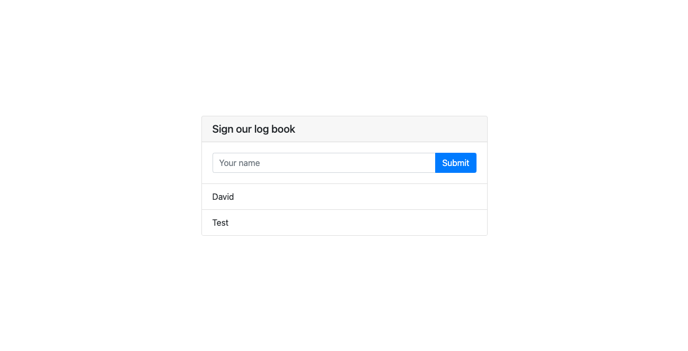

<p align="center">
  <a href="//architect.io" target="blank"></a>
</p>

# Java Spring Boot Microservices Example

This repository contains an example microservice project built in Java and using
the Spring framework. The project itself serves a simple web application that acts
as a log book for guest visitors – allowing visitors to log their name into the
application to show up on the list of previous visitors.



## Running the application

This application depends on a MySQL database to keep track of visitors. In order to
streamline the spin up of the database alongside our microservice, we've created an
[Architect Component](https://www.architect.io/docs/getting-started/core-concepts#components)
that encapsulates both the database and our project. 

### Prerequisites 

* [Architect CLI](https://github.com/architect-team/architect-cli)

### Run locally

```sh
$ architect dev ./architect.yml
```

#### Hot reloading

The project is automatically configured to hot reload when it detects changes to the compiled
code, so feel free to make changes and the application will auto-update itself.

### Cloud deployment

Architect Component's can be easily deployed to remote cloud environments with their continuous delivery platform.
Simply register the component, register a target environment, and deploy the former to the latter:

```sh
# Login to your account
$ architect login

# Register the component
$ architect register . --tag latest

# Register an environment
$ architect environments:create my-environment --platform architect

# Deploy to the environment
$ architect deploy architect/template-java-springboot:latest -e my-environment
```
